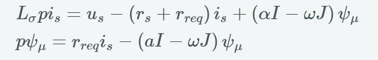
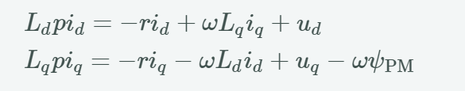
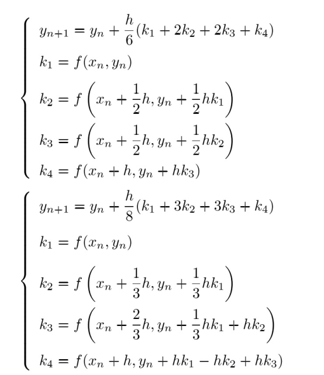

## 2. Machine Models
   ### 2.1. Model of Induction Machine
   
   ### 2.2. Model of Permanent Magnet Synchronous Machine
   
   ### 2.3. Model of Bearingless Induction Machine*
## 3. Block Diagram for the Codes
   Simulation procedure is as follows:
```
for loop begins{

    time

    machine_simulation(); // machine_dynamics, numeric_integration

    measurement(); // speed, current

    observation(); // observer 

    control(); // speed_control, current_control

    inverter_model(); // 
}
```
四阶龙格库塔法：

> 其中f(x, y)就是把微分的部分放到一边后的另一边剩余部分
> <br>求出来的就是取微分的那个变量的值